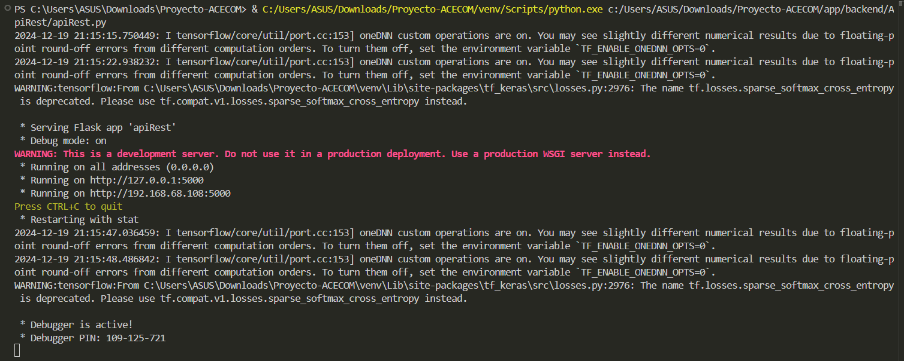
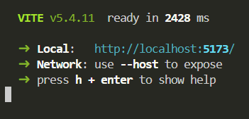
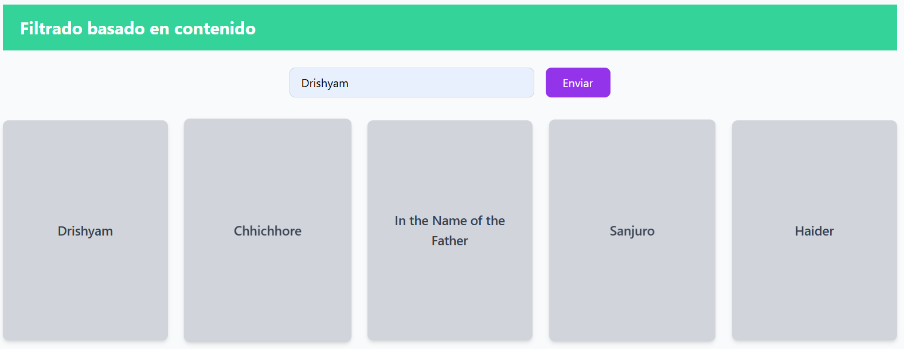
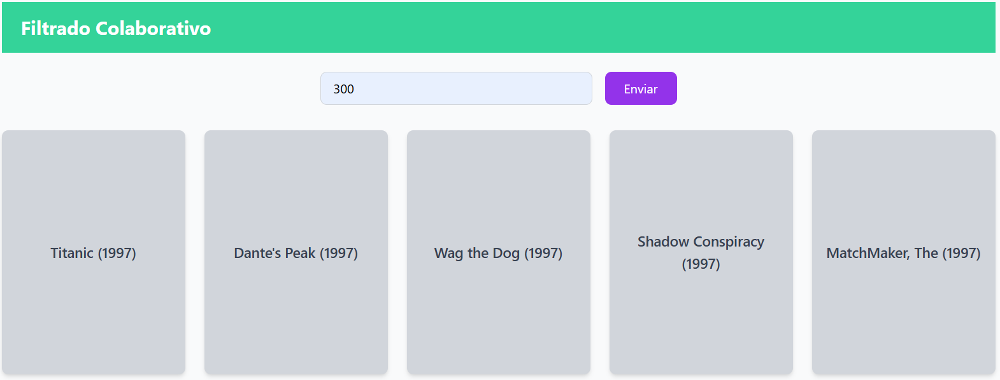
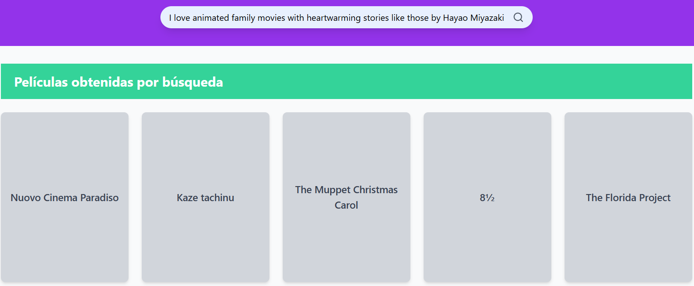

# Proyecto IA-ACECOM PAM 24-2
En este archivo documentaré el proyecto de IA que realicé para
este PAM de IA que consiste de un sistema de recomendación de
películas utilizando un enfoque hibrido utilizando tanto el filtrado colaborativo como el filtrado basado en contenido, los cuales también los aplique en un front-end para una mejor visualización de lo que hace el sistema, comenzaré explicando los datasets utilizados para este sistema.

## DATASET1
Para el filtrado basado en contenido decidí utilizar el dataset llamado **IMDB Movies Dataset** que tiene campos como **Released_Year**, **Certificate**, **Overview**, **Director**, **Star1**, **Star2**, **Star3** y **Star4**, los cuales servirán para identificar películas similares a las películas que le gustan a un usuario.

- **Poster_Link**: Like the poster que IMD está usando
- **Series_Title**: Nombre de la película
- **Released_Year**: Año de estreño
- **Certificate**: Certificado de la película
- **Runtime**: Total de tiempo de la película
- **Genre**: Género de la película
- **IMDB_Rating**: Rating de la película
- **Overview**: Resumen de la película
- **Meta_score**: Puntaje de la película
- **Director**: Nombre del director
- **Star1, Star2, Star3, Star4**: Nombre de las estrellas
- **No_of_votes**: Total de número de votos
- **Gross**: Dinero que la película recaudo

### DATASET2
Este dataset lo utilizaré para el filtrado colaborativo, contiene 100,000 registros de ratings de 943 usuarios a 1682 películas, las cuales cada usuario califoco más de 20 películas distintas. En el caso de este dataset en kaggle está dividido en varias partes, para lo cual tomé 3 datasets pequeños que lo conforman que podrían tener información relevante para el Filtrado Colaborativo. Los cuales son:

### Campos del dataset `u.data`

- id_usuario: id del usuario
- id_pelicula: id de la película
- rating: puntuación
- timestamp: Momento de registro de la puntuación

### Campos del dataset `u.item`

- id_pelicula: id de la pelicula   
- titulo_pelicula: titulo de la película  
- fecha_estreno: fecha de estreno  
- fecha_estreno_video: fecha de estreno en video
- IMDb_URL: URL de la película   
- generos: géneros de las películas, en el caso del dataset tiene 19 campos binarios.

### Campos del dataset `u.user`

- id_usuario: id del usuario  
- edad: edad del usuario  
- generos: generos del usuario  
- ocupacion: ocupacion del usuario  
- codigo_postal:  codigo postal del usuario

## Documentación del Back-end
En está sección realizaré la documentación del back-end y lo referente a ello.

### Archivo preentrenamiento.py
Después de escoger y hacer la limpieza de los datasets, hago el pre entrenamiento de los modelos en el archivo preentrenamiento.py, comenzando con el filtrado basado en contenido:

### Importaciones
Realizo las importaciones necesarias para el entrenamiento de los modelos
```python
import joblib
from sentence_transformers import SentenceTransformer
from sklearn.neighbors import NearestNeighbors
from sklearn.metrics.pairwise import cosine_similarity
import pandas as pd
import os
import sys
```

### Defino la ruta de los datasets
Aquí defino la ruta absoluta de la carpeta datasets para facilitar la carga de los archivos CSV.
```python
sys.path.append(os.path.abspath(os.path.join(os.path.dirname(__file__), '..', 'datasets')))
```

### Cargo los datasets
Cargo los datasets desde la carpeta datasets.
```python
dataset1 = pd.read_csv(os.path.join(ruta_datasets, 'dataset1.csv'))
dataset2 = pd.read_csv(os.path.join(ruta_datasets, 'dataset2.csv'))
```

### Preparo los datos para realizar el embedding del nuevo campo contenido
Creo una nueva columna **contenido** en el **dataset1** en el que combino varias columnas las cuales serán utilizadas para generar los embeddings.
```python
dataset1['contenido'] = (
    dataset1['Genre'].apply(lambda x: ' '.join(x)) + ' ' +
    dataset1['Overview'] + ' ' +
    dataset1['Star1'] + ' ' +
    dataset1['Star2'] + ' ' +
    dataset1['Star3'] + ' ' +
    dataset1['Star4']
)
```

### Lleno los valores nulos y convierto la columna
Lleno los valores NaN con una cadena vacía y aseguro que la columna **contenido** sea de tipo string.
```python
dataset1['contenido'] = dataset1['contenido'].fillna('').astype(str)
```

### Cargar el modelo de embedding
Cargo el modelo **all-MiniLM-L6-v2** para generar los embeddings de los textos.
```python
modelo_embedding = SentenceTransformer('all-MiniLM-L6-v2')
```

### Genero los embeddings
Genero los embeddings para la columna **contenido**.
```python
embedding = modelo_embedding.encode(dataset1['contenido'].tolist(), show_progress_bar=True)
```

### Guardo los embedding en un archivo
Guardo los embedding generados en un archivo **.pkl** para su uso en la api rest.
```python
joblib.dump(embedding, os.path.join(ruta_actual, 'embedding.pkl'))
```

### Calculo similitudes coseno
Calculo la matriz de similitud de coseno entre los embeddings generados.
```python
similitud_coseno = cosine_similarity(embedding, embedding)
```

### Guardo la similitud coseno
También guardo la matriz de la similitud coseno en formato **.pkl**.
```python
joblib.dump(similitud_coseno, os.path.join(ruta_actual, 'similitud_coseno.pkl'))
```

### Preparo la matriz de ratings para el modelo KNN
Creo una matriz de ratings usando **id_usuario** como indice, **id_pelicula** como columnas y completando los valores nulos como eros.
```python
rating_matrix = dataset2.pivot(index='id_usuario', columns='id_pelicula', values='rating').fillna(0)
```

### Entreno el modelo KNN
Entreno el modelo KNN utilizando la matriz de ratings y la métrica de similitud coseno.
```python
knn = NearestNeighbors(metric='cosine', algorithm='brute')
knn.fit(rating_matrix)
```

### Guardo el modelo KNN
Finalmente el modelo KNN entrenado lo guardo en el archivo **knn_model.pkl** para su uso en la api rest.

```python
joblib.dump(knn, os.path.join(ruta_actual, 'knn_model.pkl'))
```

### Cargo el modelo embedding preentrenado
Cargo el modelo embedding preentenado de de Sentence-BERT para utilizarlo en el buscador
```python
model = SentenceTransformer('paraphrase-MiniLM-L6-v2')
```

# Guardo el modelo en un archivo .pkl
Guardo el modelo embedding preentrenado en un archivo **.pkl** para hacer más rápida su ejecución.
```python
joblib.dump(model, os.path.join(ruta_actual, 'sentence_transformer_model.pkl'))
```

## Archivo apiRest.py
Ahora documentaré la api rest que realicé para después utilizarlo en el front-end.

### Importaciones necesarias
En este bloque de código ajusto las rutas para incluir la carpeta **datasets** y luego cargo los archivos CSV desde dicha carpeta.
```python
from flask import Flask, jsonify, request
import numpy as np
import pandas as pd
from sklearn.metrics.pairwise import cosine_similarity
import joblib
import os
from flask_cors import CORS

# Definición de rutas de datasets y modelos
ruta_carpeta = os.path.dirname(os.path.abspath(__file__))
ruta_datasets = os.path.join(ruta_carpeta, '..', 'datasets')

# Cargo los datasets
dataset1 = pd.read_csv(os.path.join(ruta_datasets, 'dataset1.csv'))
dataset2 = pd.read_csv(os.path.join(ruta_datasets, 'dataset2.csv'))
```

### Inicializo la aplicacion Flask y cargo los modelos
Inicializo la aplicación Flask y habilito CORS para permitir solicitudes cruzadas y se cargan los modelos preentrenados de embeddings, similitudes coseno y KNN desde archivos .pkl. También creo un diccionario de películas para mapear **id_pelicula** a sus títulos.

```python
# Inicio una instancia de Flask
app = Flask(__name__)
CORS(app)

# Cargo los modelos preentrenados
sentence_transformer = joblib.load(os.path.join(ruta_carpeta, 'sentence_transformer_model.pkl'))
similitud_coseno = joblib.load(os.path.join(ruta_carpeta, 'similitud_coseno.pkl'))
knn = joblib.load(os.path.join(ruta_carpeta, 'knn_model.pkl'))

# Creo un conjunto de géneros únicos
generos = set()
for lista_genero in dataset1["Genre"]:
    generos_limpios = lista_genero.replace('[', '').replace(']', '').replace('"', '').replace("'", "")
    for genre in generos_limpios.split(","):
        generos.add(genre.strip().lower())

# Diccionario para títulos de películas en dataset2
diccionario_pelicula = dict(zip(dataset2['id_pelicula'], dataset2['titulo_pelicula']))

```

### Función para obtener las recomendaciones basadas en contenido
Mediante está función tomo el título de una película como parámetro y busco el indice correspondiente en **dataset1**, calculo la similitud coseno para ese título y devuelvo las 5 películas más similares.
```python
def obtener_recomendaciones_contenido(titulo):
    try:
        # Obtengo el indice de la pelicula pasada por parametro
        indice = dataset1[dataset1['Series_Title'] == titulo].index[0]
        # enumero las similitudes en una lista
        puntajes_similitud = list(enumerate(similitud_coseno[indice]))
        # ordeno las similitudes en orden descendente
        puntajes_similitud = sorted(puntajes_similitud, key=lambda x: x[1], reverse=True)
        # obtengo los indices de las 10 peliculas con mayor similitud
        indices_similares = [i[0] for i in puntajes_similitud[1:6]]
        return dataset1['Series_Title'].iloc[indices_similares].tolist()
    except IndexError:
        return []
```

### Función para obtener las recomendaciones colaborativas
Con está función obtengo las recomendaciones colaborativas de una matriz de ratings de usuarios y películas buscando usuarios similares usando un modelo KNN y luego recomiendo películas no vistas por el usuario ponderadas por la distancia entre usuarios similares.
```python
def obtener_recomendaciones_colaborativo(id_usuario, cantidad_recomendaciones=5):
    # Creo una matriz de usuarios-películas
    rating_matrix = dataset2.pivot(index='id_usuario', columns='id_pelicula', values='rating').fillna(0)

    # Obtengo la fila del usuario en la matriz
    usuario_vector = rating_matrix.loc[id_usuario].values.reshape(1, -1)

    # Encuentro los usuarios más cercanos
    distancias, indices = knn.kneighbors(usuario_vector, n_neighbors=cantidad_recomendaciones + 1)

    # Excluyo al propio usuario
    usuarios_similares = indices.flatten()[1:]
    distancias_similares = distancias.flatten()[1:]

    # Combino las recomendaciones de los usuarios similares
    peliculas_recomendadas = {}
    # Obtengo las películas vistas por el usuario
    peliculas_vistas = rating_matrix.loc[id_usuario][rating_matrix.loc[id_usuario] > 0].index

    for id_similar, distancia in zip(usuarios_similares, distancias_similares):
        id_usuario_similar = rating_matrix.index[id_similar]
        peliculas_similares = rating_matrix.loc[id_usuario_similar][rating_matrix.loc[id_usuario_similar] > 0]

        for id_pelicula, rating in peliculas_similares.items():
            # Solo recomiendo películas no vistas por el usuario
            if id_pelicula not in peliculas_vistas and id_pelicula not in peliculas_recomendadas:
                peliculas_recomendadas[id_pelicula] = rating / distancia  # Pondero por la distancia

    # Ordeno las películas recomendadas por la puntuación calculada
    peliculas_ordenadas = sorted(peliculas_recomendadas.items(), key=lambda x: x[1], reverse=True)

    # Devuelvo las 5 películas recomendadas
    mejores_peliculas = [pelicula[0] for pelicula in peliculas_ordenadas[:cantidad_recomendaciones]]

    # Devuelvo las 5 películas recomendadas con sus títulos
    mejores_peliculas = [diccionario_pelicula[pelicula[0]] for pelicula in peliculas_ordenadas[:cantidad_recomendaciones] if pelicula[0] in diccionario_pelicula]

    return mejores_peliculas
```

### Función para obtener los generos del texto
Con una función verifico si el texto enviado por el buscador tiene generos incluidos y los retorna en una lista

```python
# Función para obtener los generos
def obtener_generos(texto):
    texto = texto.lower()
    return [genero for genero in generos if genero in texto]
```

### Función para obtener a las personas mencionadas en el texto
Mediente está función realizo la busqueda de de las personas mencionadas en el texto que serían directores y actores
```python
# Función para buscar a las personas en el texto
def obtener_personas_mencionadas(texto):
    personas_mencionadas = set()
    for persona in ['Director', 'Star1', 'Star2', 'Star3', 'Star4']:
        for _, row in dataset1.iterrows():
            if row[persona] and row[persona].lower() in texto.lower():
                personas_mencionadas.add(row[persona])
    return list(personas_mencionadas)
```

### Función para buscar las peliculas utilizando embedding
Mediante está función realizo la busqueda de las películas utilizando el modelo embedding de sentence-bert.
```python
def buscar_peliculas_con_embedding(texto):
    # Obtengo el embedding del texto
    embeddings_texto = sentence_transformer.encode([texto])
    # Obtengo el embedding de cada sinopsis de película
    embeddings_peliculas = sentence_transformer.encode(dataset1['Overview'].fillna("").tolist())
    personas_mencionadas = obtener_personas_mencionadas(texto)
    # Calculo las similitudes entre el embedding del texto y de las sinopsis de cada película
    similitudes = cosine_similarity(embeddings_texto, embeddings_peliculas)
    generos_texto = obtener_generos(texto)
    factor = 1.5

    # En caso en el texto haya generos o nombres de directores o nombres de actores se multiplica la similitud por un factor para aumentar la similitud
    for idx, row in dataset1.iterrows():

        if row['Director'] in personas_mencionadas:
            similitudes[0][idx] *= factor
        movie_genres = [genre.strip().lower() for genre in row['Genre'].split(',')]
        
        if any(genre in generos_texto for genre in movie_genres):
            similitudes[0][idx] *= factor

    # Obtengo las películas
    indices_similares = similitudes[0].argsort()[-5:][::-1]
    peliculas_recomendadas = dataset1.iloc[indices_similares]
    return peliculas_recomendadas['Series_Title'].tolist()
```

### Defino los endpoints para la API
Con estos endpoints de la API obtendré las recomendaciones de las 2 funciones antes mencionadas, uno será para las recomendaciones basadas en contenido **/contenido** y otro para recomendaciones colaborativas **/colaborativas**, también uno para el buscador con la extensión **/buscar**. Todos con el parámetro GET y me devolverán las recomendaciones correspondientes en formato JSON.

```python
@app.route('/contenido', methods=['GET'])
def contenido():

    titulo = request.args.get('titulo')

    if not titulo:
        return jsonify({'error': 'Proporcione un titulo de pelicula'}), 400
    recomendaciones = obtener_recomendaciones_contenido(titulo)

    if not recomendaciones:
        return jsonify({'error': 'No se encontraron recomendaciones para este titulo'}), 404
    return jsonify({'recomendaciones': recomendaciones})

@app.route('/colaborativo', methods=['GET'])
def colaborativo():

    id_usuario = request.args.get('id_usuario', type=int)

    if not id_usuario:
        return jsonify({"error": "Proporcione un id de usuario"}), 400
    recomendaciones = obtener_recomendaciones_colaborativo(id_usuario)

    if not recomendaciones:
        return jsonify({'error': 'No se encontraron recomendaciones para este usuario'}), 404
    return jsonify({"usuario": id_usuario, "recomendaciones": recomendaciones})

@app.route('/buscar', methods=['GET'])
def buscar():

    texto = request.args.get('texto', '')
    
    if not texto:
        return jsonify({"error": "Se requiere un texto para realizar la búsqueda"}), 400
    peliculas = buscar_peliculas_con_embedding(texto)
    return jsonify({"titulos": peliculas})

```

### Ejecución de la aplicación
Inicio la aplicación Flask en modo debug en el puerto 5000 y estará disponible para recibir solicitudes en todas las interfaces de red.
```python
if __name__ == '__main__':
    app.run(debug=True, host='0.0.0.0', port=5000)
```

## Documentación del Front-end
En está sección documentaré el front-end del proyecto.

### App.tsx
El archivo **App.tsx** es la entrada de la aplicación React ya que estructura la interfaz principal con un diseño dividido en un encabezado y dos secciones principales

### Importación de módulos y dependencias
Importo Rect junto con el hook **useState** para manejar el estado y además los componentes **SearchBar** y **FilterSection** desde los directorios locales, junto con funciones de una API externa.

```javascript
import React, { useState } from 'react';
import { SearchBar } from './components/SearchBar';
import { FilterSection } from './components/FilterSection';
import { getContentBasedRecommendations, getCollaborativeRecommendations, searchMoviesByText } from './services/api';
```

### Componente principal App
El estado **searchResults** se inicializa con un listado de películas predefinido el cual se actualizará dinámicamente.
```javascript
function App() {

  const [searchResults, setSearchResults] = useState<string[]>(['Movie 1', 'Movie 2', 'Movie 3', 'Movie 4', 'Movie 5']);

```

### Función **handleSearch**
Defino la lógica para buscar películas mediante una consulta de texto realizando una llamada a la API con **searchMoviesByText**
```javascript
  const handleSearch = async (query: string) => {
    try {
      const results = await searchMoviesByText(query);
      console.log("Resultados de búsqueda:", results);
      setSearchResults(results);
    } catch (error) {
      console.error("Error al realizar la búsqueda:", error);
      setSearchResults(['Error al cargar']);
    }
  };

```

### Estructura general del componente
Retorno un componente principal que abarca toda la pantalla y contiene un encabezado **header** con un componente de barra de búsqueda **SerchBar**
```javascript
  return (
    <div className="min-h-screen bg-gray-50">
      <header className="bg-purple-600 py-8 px-4">
        <SearchBar onSearch={handleSearch} />
      </header>

```

### Resultados de la búsqueda
Muestro los resultados de las películas obtenidas que se obtienen en **searchResults** y las renderizo como tarjetas.
```javascript
      <main className="container mx-auto px-4">
        <div className="py-8">
          <div className="bg-emerald-400 py-4 px-6 mb-6">
            <h2 className="text-2xl font-bold text-white">Películas obtenidas por búsqueda</h2>
          </div>
          <div className="grid grid-cols-1 sm:grid-cols-2 md:grid-cols-3 lg:grid-cols-5 gap-6">
            {searchResults.length > 0 ? (
              searchResults.map((movie, index) => (
                <div key={index} className="bg-gray-300 aspect-[3/4] rounded-lg shadow-md flex items-center justify-center p-4 transition-transform hover:scale-105">
                  <h3 className="text-lg font-medium text-center text-gray-700">{movie}</h3>
                </div>
              ))
            ) : (
              <p className="text-center text-gray-500 col-span-full">No se encontraron resultados.</p>
            )}
          </div>
        </div>
```

### Sección de filtrado por contenido
Integro una sección para realizar filtrado basado en contenido de las películas utilizando la API.
```javascript
        <FilterSection
          title="Filtrado basado en contenido"
          inputLabel="Título de película"
          inputPlaceholder="Ingrese el título de una película..."
          onSubmit={getContentBasedRecommendations}
          defaultMovies={['Movie 1', 'Movie 2', 'Movie 3', 'Movie 4', 'Movie 5']}
        />

```

### Sección de filtrado colaborativo
Agrego una segunda sección enfocada en filtrado colaborativo.
```javascript
        <FilterSection
          title="Filtrado Colaborativo"
          inputLabel="ID de Usuario"
          inputPlaceholder="Ingrese el ID del usuario..."
          onSubmit={getCollaborativeRecommendations}
          defaultMovies={['Movie 6', 'Movie 7', 'Movie 8', 'Movie 9', 'Movie 10']}
        />
```

### Exportación del componente
Por último exporto el componente **App**
```javascript
export default App;
```

### Componente FilterSection.tsx

### Importación de módulos y dependencias
Importo React y el hook **useState** para manejar estados, también importo el componente **MovieSection** y una función API.
```javascript
import React, { useState } from 'react';
import { MovieSection } from './MovieSection';
import { getContentBasedRecommendations } from '../services/api';  

```

### Defino las propiedades del componente
Defino una interfaz que recibe el componente con sus propiedades.
```javascript
interface FilterSectionProps {
  // Título de la sección
  title: string;
  // Etiqueta para el campo de entrada
  inputLabel: string;
  // Texto de muestra para el campo de entrada
  inputPlaceholder: string;
  // Función que se espera devuelva un array de recomendaciones
  onSubmit: (value: string) => Promise<string[]>; 
  // Películas predefinidas 
  defaultMovies: string[];
}

```

### Defino el componente FilterSection
Defino el componente funcional **FilterSection**
```javascript
export function FilterSection({ title, inputLabel, inputPlaceholder, onSubmit, defaultMovies }: FilterSectionProps) {
  // Manejo el estado de las películas mostradas
  const [movies, setMovies] = useState<string[]>(defaultMovies);
  // Estado booleano para indicar si una solicitud está en progreso
  const [loading, setLoading] = useState(false);
  // Permite almacenar un mensaje de error
  const [error, setError] = useState<string | null>(null);

```

### Manejador del formulario
Defino el comportamiento por defecto del formulario que obtiene un valor ingresado en el campo de texto y realiza una llamada a **onSubmit** para obtener las recomendaciones.
```javascript
  const handleSubmit = async (e: React.FormEvent<HTMLFormElement>) => {
    e.preventDefault();
    const formData = new FormData(e.currentTarget);
    const value = formData.get('input') as string;

    setLoading(true);
    setError(null);  

    try {
      const recommendations = await onSubmit(value); 
      setMovies(recommendations); 
    } catch (error) {
      setError('No se pudieron obtener las recomendaciones.');  
    }

    setLoading(false);
  };

```

### Estructura del componente renderizado
Defino un contenedor con un título estilizado que utiliza las propiedades recibidas.
```javascript
  return (
    <section className="py-8">
      <div className="bg-emerald-400 py-4 px-6 mb-6">
        <h2 className="text-2xl font-bold text-white">{title}</h2>
      </div>

```

### Formula de entrada
Este formulario contiene un campo de texto para la entrada del usuario y un botón para ejecutar la búsqueda.
```javascript
      <form onSubmit={handleSubmit} className="mb-8 max-w-md mx-auto">
        <div className="flex gap-4">
          <input
            type="text"
            name="input"
            placeholder={inputPlaceholder}
            className="flex-1 px-4 py-2 rounded-lg border border-gray-300 focus:outline-none focus:ring-2 focus:ring-purple-500"
            required
          />
          <button
            type="submit"
            className="px-6 py-2 bg-purple-600 text-white rounded-lg hover:bg-purple-700 focus:outline-none focus:ring-2 focus:ring-purple-500 focus:ring-offset-2"
            disabled={loading}
          >
            {loading ? 'Cargando...' : 'Buscar'}
          </button>
        </div>
      </form>

```

### Mensajes de error
Si ocurre un error se muestra un mensaje en color rojo.
```javascript
      {/* Mostrar error si ocurre uno */}
      {error && <div className="text-red-500">{error}</div>}

```

### Sección de películas
Mediante el componente renderizo las películas almacenadas en el estado **movies**.
```javascript
      {/* Mostrar las películas obtenidas */}
      <MovieSection movies={movies} />
    </section>
  );
}

```

### Exportación del componente
Exporto el componente para que pueda ser reutilizado
```javascript
export function FilterSection;

```

### Componente MovieCard.tsx

### Importo los módulos
Importo React
```javascript
import React from 'react';

```

### Defino las propiedades del componente
Defino la interfaz para especificar las propiedades que el componente reciba.
```javascript
interface MovieCardProps {
  title: string;
}

```

### Defino el componente
Defino el componente funcional para que reciba la propiedad **title**
```javascript
export function MovieCard({ title }: MovieCardProps) {

```

### Estructuro el componente renderizado
El componente devuelve un contenedor que estiliza y muestra el título de una película.
```javascript
  return (
    <div className="bg-gray-300 aspect-[3/4] rounded-lg shadow-md flex items-center justify-center p-4 transition-transform hover:scale-105">
      <h3 className="text-lg font-medium text-center text-gray-700">{title}</h3>
    </div>
  );

```

### Exportación del componente
El componente se exporta
```javascript
export function MovieCard;

```

### Componente MovieSection
### Importación de módulos
Importo React y el módulo **MovieCard**.
```javascript
import React from 'react';
import { MovieCard } from './MovieCard';

```

### Defino las propiedades del componente
Defino la interfaz **MovieSectionProps** para especificar las propiedades que el componente espera recibir.
```javascript
interface MovieSectionProps {
  movies: string[];
}

```

### Defino el componente **MovieSection**
Declaro el componente funcional **MovieSection** y accedo a la propiedad **movies**.
```javascript
export function MovieSection({ movies }: MovieSectionProps) {

```

### Renderizo el contenido
Renderizo el componente con un estilo y estructura adecuados.
```javascript
return (
  <div className="grid grid-cols-1 sm:grid-cols-2 md:grid-cols-3 lg:grid-cols-5 gap-6">
    {movies.map((movie, index) => (
      <MovieCard key={index} title={movie} />
    ))}
  </div>
);

```

### Exportación del componente
Exporto el componente para ser utilizado.
```javascript
export function MovieSection;

```

### Componente **SearchBar**
Con este componente permite a los usuarios realizar búsquedas ingresando texto en un cuadro y enviando el formulario.

### Importación de módulos
Importo React y los componentes funcionales necesarios.
```javascript
import React from 'react';
import { Search } from 'lucide-react';

```

### Defino las propiedades del componente
Defino una interfaz con las propiedades esperadas para el componente.
```javascript
interface SearchBarProps {
  onSearch: (query: string) => void;
}

```

### Defino el componente SearchBar
Declaro un componente funcional **SearchBar** para acceder a la propiedad **onSearch**.
```javascript
export function SearchBar({ onSearch }: SearchBarProps) {

```

### Manejador del evento de envío
Mediante está función el usuario captura el texto ingresado en el cuadro de búsqueda y lo pasa a la función **onSearch** para que se le envíe a la API externa y de esa manera obtener las películas.
```javascript
const handleSubmit = (e: React.FormEvent<HTMLFormElement>) => {
  e.preventDefault();
  const formData = new FormData(e.currentTarget);
  const query = formData.get('search') as string;
  onSearch(query);
};

```

### Renderización del contenido
Renderizo el contenido con una estructura y estilos adecuados para el búscador.
```javascript
return (
  <form onSubmit={handleSubmit} className="relative w-full max-w-2xl mx-auto">
    <input
      type="text"
      name="search"
      placeholder="Buscar películas..."
      className="w-full px-4 py-2 rounded-full bg-white/90 shadow-lg focus:outline-none focus:ring-2 focus:ring-purple-500"
    />
    <button
      type="submit"
      className="absolute right-2 top-1/2 -translate-y-1/2 p-2 text-gray-600 hover:text-purple-600"
    >
      <Search size={20} />
    </button>
  </form>
);

```

### Exportación del componente
Exporto el componente para su uso en otras partes.

```javascript
export function SearchBar;

```

### Api externa
Mediante está api externa el usuario puede envíar una solicitud desde el front-end hacia el back-end mediante solicitudes http y recibir sus respuestas.

### Importación de dependencias
Importo la biblioteca **axios** que permite solicitudes HTTP.
```javascript
import axios from 'axios';

```

### Definición de las URLs de la API
Defino las 3 URLs que utilizaré en la API, cada uno es para una tarea en especifico que involucran el filtrado basado en contenido, filtrado colaborativo y la búsqueda de películas.
```javascript
const API_BASE_URL1 = 'http://127.0.0.1:5000/contenido'; 
const API_BASE_URL2 = 'http://127.0.0.1:5000/colaborativo';  
const API_BASE_URL_SEARCH = 'http://127.0.0.1:5000/buscar';

```

### Función **getContentBasedRecommendations**
Mediante está función realizo solicitudes http para obtener las películas recomendadas mediante el filtrado basado en contenido al usuario al enviar un título de película a la API.
```javascript
export async function getContentBasedRecommendations(movieTitle: string): Promise<string[]> {
  try {
    const response = await axios.get(`${API_BASE_URL1}?titulo=${encodeURIComponent(movieTitle)}`);
    return response.data.recomendaciones;
  } catch (error) {
    console.error('Error fetching content-based recommendations:', error);
    return ['Error al cargar'];
  }
}

```

### Función **getCollaborativeRecommendations**
Mediante está función realizo solicitudes http para obtener las películas recomendadas mediante el filtrado colaborativo al usuario al enviar un id de usuario a la API.
```javascript
export async function getCollaborativeRecommendations(userId: string): Promise<string[]> {
  try {
    const response = await axios.get(`${API_BASE_URL2}?id_usuario=${encodeURIComponent(userId)}`);
    return response.data.recomendaciones;
  } catch (error) {
    console.error('Error fetching collaborative recommendations:', error);
    return ['Error al cargar'];
  }
}

```

### Función **searchMoviesByText**
Mediante está función realizo solicitudes http para obtener las películas recomendadas mediante el buscador al usuario al enviar un texto a la API.
```javascript
export async function searchMoviesByText(query: string): Promise<string[]> {
  try {
    const response = await axios.get(`${API_BASE_URL_SEARCH}?texto=${encodeURIComponent(query)}`);
    console.log(response);
    return response.data.titulos || [];
  } catch (error: any) {
    console.error("Error:", error.response ? error.response.data : error.message);
    return ['Error al realizar la búsqueda'];
  }
}

```

## Ejecución del proyecto
Para este proyecto es necesario ejecutar la api rest del back-end y el front-end de manera individual, comenzaré ejecutando el back-end.

### Ejecución del back-end
Realizo la ejecución de la api rest para hacer solicitudes.



### Ejecución del front-end
Realizo la ejecución del front-end mediante el comando **npm run dev**




### Uso del proyecto
El proyecto tiene 3 secciones en las que se muestra los resultados que se obtienen de películas por los 3 métodos, el primero de ellos que explicaré es el de **Filtrado basado en contenido**. Que consta de enviar un nombre de película y recibe 5 títulos de películas



La siguiente sección es sobre el **Filtrado Colaborativo**, en está sección renvio un id de usuario y me envía 5 títulos de películas recomendadas.



La última sección es del buscador que recibirá un texto y me enviará 5 películas recomendadas en base a la busqueda




